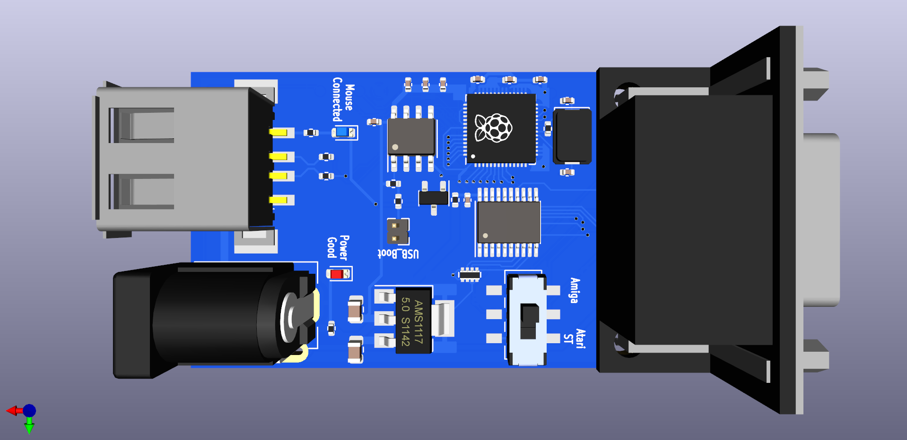
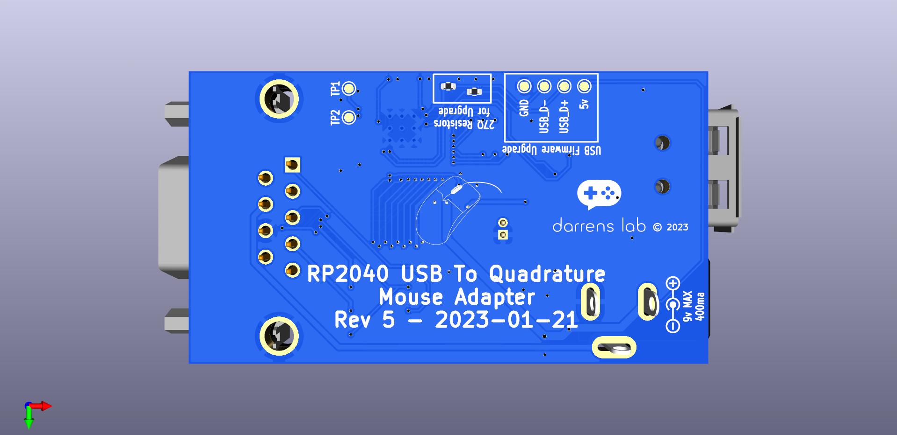

# RP2040_Mouse_KiCAD
This is the hardware side of an RP2040 USB to Quadrature mouse adaptor used with retro computers, the software is available at https://github.com/Black-FX/RP2040_Mouse

A PDF of the scematic is available in [Here](PDF/scematic.pdf)

Glamour shots

# Ordering

You can order the boards here:

[PCBWay](https://www.pcbway.com/project/shareproject/RP2040_USB_Mouse_to_Quadrature_15de42f1.html)

I sell pre-assembled and programmed ones here:

[Tindie](https://www.tindie.com/products/darrens_lab/rp2040-usb-to-quadrature-mouse-adapter/)

[EBay](https://www.ebay.com/usr/darrens_lab_nz?_trksid=p2047675.m145687.l151929)

[Trademe NZ & Aus](https://www.trademe.co.nz/a/search?member_listing=7404797&bof=McH9Ulww)
